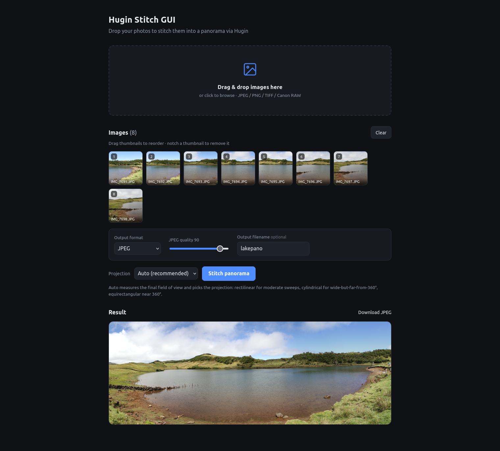

# Hugin Stitch GUI

A local web UI for panorama stitching that drives the [Hugin](https://hugin.sourceforge.io/)
command-line tools. Drop photos into the browser, reorder them, pick a projection, and get a
stitched panorama back.

The server is a single Python file on the standard library `http.server`. Nothing is bundled,
nothing is uploaded anywhere: images stay on the machine running it, and all the heavy lifting
is done by the Hugin binaries already installed on the system.



## What it does

- Drag-and-drop queue with thumbnails, drag-to-reorder, and per-image removal
- Accepts JPEG, PNG, BMP, TIFF, WebP, HEIC, and RAW (CR2, CR3, NEF, ARW, DNG)
- Projection choice: auto, rectilinear, cylindrical, or equirectangular
- Auto mode measures the horizontal field of view from the optimised project and picks
  rectilinear up to 100°, cylindrical up to 240°, equirectangular beyond that
- Live progress with per-phase weighting (cpfind and blending dominate the wall clock)
- PNG preview in the browser; output format selectable from all the formats
  Hugin supports, each explained in the UI before you commit: TIFF (8-bit
  lossless), PNG (8-bit lossless), JPEG (lossy, with a quality slider), HDR
  TIFF (32-bit float linear), or OpenEXR (32-bit float linear)
- Optional custom output filename (the app falls back to a timestamp- or
  first-frame-derived name otherwise)
- Copies the original capture time and EXIF data from the first frame into the
  stitched panorama (via `exiftool` when installed), and uses it to name the
  download file

## Requirements

Hugin's CLI tools must be on `PATH`:

```
pto_gen  cpfind  autooptimiser  pano_modify  hugin_executor  nona  enblend
```

On Debian/Ubuntu:

```bash
sudo apt install hugin-tools enblend
```

`exiftool` is optional; when present it copies the original EXIF date/time and
metadata into the stitched panorama so the result keeps its capture timestamp.
Without it the stitch still works, just without the metadata transfer.

Python dependencies (`Pillow` for previews, `rawpy` for RAW decoding):

```bash
python3 -m venv .venv
.venv/bin/pip install -r requirements.txt
```

## Running

```bash
python3 app.py          # http://127.0.0.1:8765
python3 app.py 9000     # or pick a port
```

Open the URL, drop images in, click **Stitch panorama**.

## Running with Docker

Build an image that bundles the app plus Pillow, rawpy, the Hugin toolchain, and
ExifTool, then run it on any machine with Docker:

```bash
docker build -t hugin-stitch-gui .
docker run --rm -p 8765:8765 hugin-stitch-gui
```

Open http://localhost:8765. Inside the container the server binds to
`0.0.0.0` (set `HOST`/`PORT` env vars to override). Stitch output is served
over HTTP and scratch files live in the container's temp dir, so no volume is
required; mount one under it if you want outputs on the host.

Note that containers generally don't expose GPUs, so `enblend` falls back to
CPU blending unless you pass `--device /dev/dri` (or `--gpus all` with the
NVIDIA Container Toolkit) and your build of enblend was compiled with OpenCL.

## How stitching works

```
pto_gen        create the project from the input images
cpfind         find control points between overlapping frames
autooptimiser  solve for camera positions and lens parameters
pano_modify    set projection, field of view, crop, canvas, output type/quality
hugin_executor remap with nona, blend with enblend into the chosen format
```

`enblend` uses OpenCL when it was built with GPU support, which is where most of the blending
speed comes from on large panoramas.

## HTTP interface

| Method | Path             | Purpose                                      |
|--------|------------------|----------------------------------------------|
| POST   | `/stitch`        | Multipart upload of images + projection/format/quality/filename fields, returns a job id |
| GET    | `/status/<id>`   | Job state, progress fraction, current phase message |
| GET    | `/result/<id>`   | PNG preview of the finished panorama         |
| GET    | `/download/<id>` | Stitched panorama in the chosen format (TIFF, PNG, JPEG, HDR TIFF, or EXR) |
| POST   | `/health`        | Toolchain availability report                |

Uploads are capped at 4 GB per request. Jobs run in a background thread and write to a
temporary directory per job.

## Layout

```
app.py              server, job runner, and Hugin pipeline
Dockerfile          container image with the full toolchain
requirements.txt    Pillow, rawpy
static/index.html   UI markup
static/app.js       queue, drag-and-drop, progress polling
static/style.css    styling
static/screenshot.png  screenshot used in this README
```

## License

MIT — see [LICENSE](LICENSE). The application is your own code and only invokes
the external tools as separate command-line processes, so their copyleft
licenses (GPL for Hugin/Enblend, GPL/Artistic for ExifTool) don't apply to this
project; the binaries themselves keep their own licenses.

## Notes

This is a local tool. It binds to `127.0.0.1` and has no authentication, so don't expose it to a
network you don't control.
